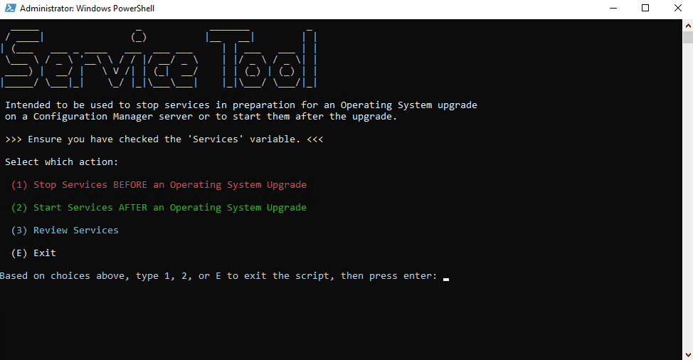

# OS Upgrade Services Tool

This powershell tool is designed to stop services and set them to disabled ready for you to perform an operating system upgrade on a Configuration Manager server. You can check the services before you make any changes and you can start them again following the upgrade.

## Services Overview

The following services are checked 'out-of-the-box'

### Configuration Manager SMS Services

- 'SMS_EXECUTIVE' | Core service that runs all major site components, should be stopped to prevent active processing during upgrade.
- 'SMS_SITE_COMPONENT_MANAGER' | Manages installation/config of site components, stop it to avoid component reconfig during system changes.
- 'SMS_NOTIFICATION_SERVER' | Handles client notification channels, stopping avoids real-time comms interference during upgrade.
- 'SMS_POLICY_PROVIDER' | Evaluates and delivers policy to clients, halt to avoid policy updates during upgrade.
- 'SMS_STATE_SYSTEM' | Processes client state messages, stop it to prevent database writes during critical system changes.
- 'SMS_MP_CONTROL_MANAGER' | Monitors Management Point health, stop it to reduce service churn or role restarts.
- 'SMS_SITE_SQL_BACKUP' | Manages site database backups, disable to avoid backup jobs conflicting with upgrade.
- 'SMS_SITE_VSS_WRITER' | Supports VSS backups for ConfigMgr, disable to avoid VSS activity or locking conflicts during upgrade.

### IIS Services

- 'W3SVC' | (World Wide Web Publishing Service) – Hosts and manages IIS web applications including ConfigMgr roles like the Management Point and Software Update Point, stop it to prevent web traffic and role communication during the upgrade.
- 'WAS' | WAS (Windows Process Activation Service) – Provides process activation and dependency management for IIS applications, stop it to ensure IIS‑hosted components fully shut down before the OS upgrade.

### SQL Services

- 'MSSQLSERVER' | The core SQL Server database engine service that hosts the Configuration Manager site database (and WSUS/SUP if applicable), must be stopped to prevent data corruption during an OS upgrade.
- 'SQLSERVERAGENT' | Manages scheduled jobs and alerts in SQL Server, not critical to stop for ConfigMgr but best practice to halt for consistency and to prevent background task execution during the upgrade.
- 'SQLBrowser' | Enables client applications to locate SQL Server instances, especially needed for named instances, safe to stop during maintenance.
- 'ReportServer' **Change if you use named instance (e.g., 'ReportServer$INSTANCE')** | Hosts the SQL Server Reporting Services (SSRS) engine used by ConfigMgr for reporting. If you're using a named instance, this service name will be ReportServer$INSTANCE (e.g., ReportServer$CM), and the correct name must be used or it won’t be found or stopped correctly.
- 'SQLWriter' | Allows SQL Server to interact with Volume Shadow Copy Services (VSS) for backups, recommended to stop to avoid conflicts or lockups with system components during the OS upgrade.

## Usage

Simply call the script using an administrative console window (so that you have rights to edit the services state) and follow the on screen instructions.

## Demo

In this demo (not real time, you may have to wait longer for the services to stop/start, please be patient and wait for the batch job to finish), I firstly check the services and their running state, then I disabled them and stop them from running. I then move to start them again.

